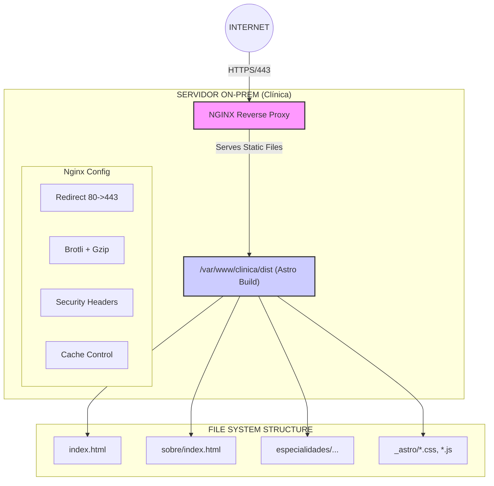

# Plano Arquitetural: Website Clínica Oncológica — Self-Hosted via Nginx

## 1. Resumo Executivo de Decisão

### Stack Recomendado para Fase 1

| Componente | Escolha | Justificativa |
| :--- | :--- | :--- |
| **Framework** | **Astro 4.x** | Static-first, islands architecture, zero JS por padrão, Content Collections |
| **Servidor** | **Nginx (on-prem)** | Já disponível, performático, estável, sem custo adicional |
| **Formulários** | **JotForm (embed)** | Dados não-sensíveis apenas, compliance HIPAA disponível |
| **Deploy** | **rsync + SSH** | Simples, auditável, sem dependências externas |
| **CMS (Fase 2)** | **Decap CMS ou Keystatic** | Git-based, sem backend, integração nativa com Astro |

### Por que Astro e não Next.js?

| Astro | Next.js Static Export |
| :--- | :--- |
| ✅ Zero JS por padrão | ⚠️ Sempre carrega React runtime (~40kb) |
| ✅ Partial hydration nativo | ⚠️ Hydration completa obrigatória |
| ✅ Build output limpo | ⚠️ Estrutura de pastas complexa |
| ✅ Melhor Core Web Vitals | ⚠️ Bundle maior por padrão |
| ✅ Content Collections | ⚠️ Requer libs externas (contentlayer) |
| ✅ Integração Markdown/MDX | ✅ Suporta MDX |
| ✅ Sitemap/RSS nativos | ⚠️ Precisa de plugins |

**Decisão Final:** Astro é superior para site público estático com foco em SEO e performance.

---

## 2. Arquitetura de Infraestrutura



```text
                    ╳ BARREIRA DE ISOLAMENTO TOTAL ╳

┌─────────────────────────────────────────────────────────────────────────┐
│                         VPS (VPN Only — Isolada)                        │
│  ┌────────────────────┐  ┌────────────────────┐                        │
│  │       n8n          │  │    PostgreSQL      │                        │
│  │  (workflows)       │◄─┤  (dados clínicos)  │                        │
│  └────────────────────┘  └────────────────────┘                        │
│                                                                          │
│  🔒 Sem portas públicas expostas                                        │
│  🔒 Acesso apenas via VPN para equipe interna                          │
│  🔒 Site público NUNCA conecta aqui                                    │
└─────────────────────────────────────────────────────────────────────────┘
```

---

## 3. Fase 1 — Site Público (NOW)

### 3.1 Estrutura do Repositório

```text
clinica-website/
├── astro.config.mjs          # Configuração Astro
├── package.json
├── tsconfig.json
├── .env.example              # Variáveis de ambiente (se necessárias)
├── .gitignore
│
├── src/
│   ├── layouts/
│   │   ├── BaseLayout.astro       # HTML base, meta tags, footer CFM
│   │   └── PageLayout.astro       # Layout para páginas de conteúdo
│   │
│   ├── components/
│   │   ├── Header.astro           # Navegação principal
│   │   ├── Footer.astro           # Footer com dados CFM obrigatórios
│   │   ├── SEOHead.astro          # Meta tags, Open Graph, Schema.org
│   │   ├── JotformEmbed.astro     # Componente para embeds seguros
│   │   ├── Glossary.astro         # Tooltip/modal para termos médicos
│   │   └── CallToAction.astro     # Botões de agendamento
│   │
│   ├── content/
│   │   ├── config.ts              # Content Collections schema
│   │   ├── especialidades/        # Markdown para cada especialidade
│   │   │   ├── oncologia-hepatica.md
│   │   │   └── oncologia-coloretal.md
│   │   ├── glossario/             # Termos médicos humanizados
│   │   │   └── termos.json
│   │   └── orientacoes/           # Guias pós-procedimento
│   │       └── pos-operatorio-geral.md
│   │
│   ├── pages/
│   │   ├── index.astro            # Home (3 caminhos)
│   │   ├── sobre.astro            # Sobre + dados CFM
│   │   ├── especialidades/
│   │   │   ├── index.astro        # Lista de especialidades
│   │   │   └── [...slug].astro    # Páginas dinâmicas por especialidade
│   │   ├── agende.astro           # Formulário de contato (JotForm)
│   │   ├── prepare-se.astro       # Checklist pré-consulta
│   │   ├── glossario.astro        # Glossário humanizado
│   │   ├── guia-acompanhante.astro
│   │   ├── politica-privacidade.astro
│   │   └── 404.astro
│   │
│   ├── styles/
│   │   └── global.css             # Estilos globais (design tokens)
│   │
│   └── data/
│       └── clinic.json            # Dados da clínica (CFM, contatos)
│
├── public/
│   ├── favicon.ico
│   ├── og-image.jpg               # Open Graph default
│   └── fonts/                     # Fontes locais (self-hosted)
│
├── scripts/
│   └── deploy.sh                  # Script de deploy rsync
│
└── nginx/
    └── clinica.conf               # Configuração Nginx de referência
```

### 3.2 Configuração Astro (`astro.config.mjs`)

```javascript
import { defineConfig } from 'astro/config';
import sitemap from '@astrojs/sitemap';

export default defineConfig({
  site: 'https://www.clinicaoncologia.com.br', // Substituir pelo domínio real
  output: 'static',
  trailingSlash: 'always',  // URLs terminam com /
  build: {
    format: 'directory',    // /sobre/ em vez de /sobre.html
    assets: '_astro',       // Pasta de assets com hash
  },
  integrations: [
    sitemap({
      filter: (page) => !page.includes('/404'),
    }),
  ],
  vite: {
    build: {
      cssMinify: true,
      minify: 'esbuild',
    },
  },
});
```

### 3.3 Configuração Nginx (`/etc/nginx/sites-available/clinica`)

```nginx
server {
    listen 80;
    server_name www.clinicaoncologia.com.br clinicaoncologia.com.br;
    return 301 https://www.clinicaoncologia.com.br$request_uri;
}

server {
    listen 443 ssl http2;
    server_name www.clinicaoncologia.com.br;

    # SSL (Let's Encrypt via Certbot)
    ssl_certificate /etc/letsencrypt/live/clinicaoncologia.com.br/fullchain.pem;
    ssl_certificate_key /etc/letsencrypt/live/clinicaoncologia.com.br/privkey.pem;
    ssl_protocols TLSv1.2 TLSv1.3;
    ssl_ciphers ECDHE-ECDSA-AES128-GCM-SHA256:ECDHE-RSA-AES128-GCM-SHA256;
    ssl_prefer_server_ciphers off;
    ssl_session_cache shared:SSL:10m;
    ssl_session_timeout 1d;
    ssl_session_tickets off;

    # Root
    root /var/www/clinica/dist;
    index index.html;

    # Security Headers
    add_header X-Frame-Options "SAMEORIGIN" always;
    add_header X-Content-Type-Options "nosniff" always;
    add_header X-XSS-Protection "1; mode=block" always;
    add_header Referrer-Policy "strict-origin-when-cross-origin" always;
    add_header Strict-Transport-Security "max-age=31536000; includeSubDomains" always;
    add_header Content-Security-Policy "default-src 'self'; script-src 'self' 'unsafe-inline' https://form.jotform.com https://www.googletagmanager.com; style-src 'self' 'unsafe-inline' https://fonts.googleapis.com; font-src 'self' https://fonts.gstatic.com; img-src 'self' data: https:; frame-src https://form.jotform.com; connect-src 'self' https://www.google-analytics.com;" always;

    # Compression
    gzip on;
    gzip_vary on;
    gzip_min_length 1024;
    gzip_proxied any;
    gzip_types text/plain text/css text/xml text/javascript application/javascript application/xml+rss application/json image/svg+xml;

    # Static Assets Caching (imutáveis por hash)
    location /_astro/ {
        expires 1y;
        add_header Cache-Control "public, immutable";
    }

    # Fontes
    location /fonts/ {
        expires 1y;
        add_header Cache-Control "public, immutable";
    }

    # HTML - cache curto para permitir atualizações
    location / {
        try_files $uri $uri/ =404;
        expires 1h;
        add_header Cache-Control "public, must-revalidate";
    }

    # Error pages
    error_page 404 /404/index.html;
    error_page 500 502 503 504 /50x.html;
    location = /50x.html {
        root /usr/share/nginx/html;
    }

    # Deny access to hidden files
    location ~ /\. {
        deny all;
    }
}

# Redirect non-www to www
server {
    listen 443 ssl http2;
    server_name clinicaoncologia.com.br;
    ssl_certificate /etc/letsencrypt/live/clinicaoncologia.com.br/fullchain.pem;
    ssl_certificate_key /etc/letsencrypt/live/clinicaoncologia.com.br/privkey.pem;
    return 301 https://www.clinicaoncologia.com.br$request_uri;
}
```

### 3.4 SEO Essentials

**Estrutura de URLs (Definitivas — Não Mudar)**

*   `https://www.clinicaoncologia.com.br/` (Home)
*   `https://www.clinicaoncologia.com.br/sobre/` (Sobre + CFM)
*   `https://www.clinicaoncologia.com.br/especialidades/` (Lista)
*   `https://www.clinicaoncologia.com.br/especialidades/oncologia-hepatica/`
*   `https://www.clinicaoncologia.com.br/especialidades/oncologia-coloretal/`
*   `https://www.clinicaoncologia.com.br/agende/` (Contato/Agendamento)
*   `https://www.clinicaoncologia.com.br/prepare-se/` (Checklist pré-consulta)
*   `https://www.clinicaoncologia.com.br/glossario/` (Termos humanizados)
*   `https://www.clinicaoncologia.com.br/politica-privacidade/`

**Meta Tags Obrigatórias (`SEOHead.astro`)**

```astro
---
interface Props {
  title: string;
  description: string;
  canonical?: string;
  ogImage?: string;
  noindex?: boolean;
}
const { title, description, canonical, ogImage, noindex = false } = Astro.props;
const siteUrl = 'https://www.clinicaoncologia.com.br';
---

<title>{title} | Clínica de Oncologia Cirúrgica</title>
<meta name="description" content={description} />
<link rel="canonical" href={canonical || Astro.url.href} />

{noindex && <meta name="robots" content="noindex, nofollow" />}

<!-- Open Graph -->
<meta property="og:type" content="website" />
<meta property="og:title" content={title} />
<meta property="og:description" content={description} />
<meta property="og:url" content={canonical || Astro.url.href} />
<meta property="og:image" content={ogImage || `${siteUrl}/og-image.jpg`} />
<meta property="og:locale" content="pt_BR" />

<!-- Twitter -->
<meta name="twitter:card" content="summary_large_image" />
<meta name="twitter:title" content={title} />
<meta name="twitter:description" content={description} />

<!-- Schema.org MedicalBusiness -->
<script type="application/ld+json" set:html={JSON.stringify({
  "@context": "https://schema.org",
  "@type": "MedicalBusiness",
  "name": "Clínica de Oncologia Cirúrgica",
  "description": description,
  "url": siteUrl,
  "telephone": "+55-11-XXXX-XXXX",
  "address": {
    "@type": "PostalAddress",
    "streetAddress": "Rua ...",
    "addressLocality": "São Paulo",
    "addressRegion": "SP",
    "postalCode": "00000-000",
    "addressCountry": "BR"
  },
  "medicalSpecialty": "Oncology",
  "openingHours": "Mo-Fr 08:00-18:00"
})} />
```

**robots.txt**

```text
User-agent: *
Allow: /

Sitemap: https://www.clinicaoncologia.com.br/sitemap-index.xml
```

### 3.5 Checklist de Segurança (Fase 1)

*   [ ] HTTPS obrigatório (Let's Encrypt + auto-renovação via Certbot)
*   [ ] Redirect HTTP → HTTPS (301 permanente)
*   [ ] Security headers configurados (CSP, HSTS, X-Frame-Options)
*   [ ] Sem exposição de versões (Nginx server_tokens off)
*   [ ] Formulários via JotForm (nenhum dado sensível no servidor próprio)
*   [ ] Consentimento LGPD explícito em formulários
*   [ ] Backup automatizado do conteúdo (git + rsync)
*   [ ] Firewall UFW configurado (apenas 80, 443, 22)
*   [ ] SSH com chave pública apenas (sem senha)
*   [ ] Fail2ban para proteção contra brute-force

### 3.6 Workflow de Deploy

**Script `scripts/deploy.sh`:**

```bash
#!/bin/bash
set -e

# Configurações
REMOTE_USER="deploy"
REMOTE_HOST="clinica.server.local"
REMOTE_PATH="/var/www/clinica/dist"
BUILD_DIR="./dist"

echo "🔨 Building Astro site..."
npm run build

echo "📦 Syncing to production..."
rsync -avz --delete \
  --exclude='.git' \
  --exclude='node_modules' \
  "$BUILD_DIR/" \
  "$REMOTE_USER@$REMOTE_HOST:$REMOTE_PATH/"

echo "✅ Deploy complete!"
echo "🌐 Site live at: https://www.clinicaoncologia.com.br"
```

**Fluxo:**
Local Development → git push → Manual: `./scripts/deploy.sh` → Nginx serves static files

---

## 4. Fase 2 — Crescimento Editorial (GROWTH)

### 4.1 O que muda

| Aspecto | Fase 1 | Fase 2 |
| :--- | :--- | :--- |
| **Edição de conteúdo** | Desenvolvedor (código) | Equipe editorial (CMS) |
| **Frequência de posts** | Eventual | Semanal |
| **Gestão de imagens** | Manual | Media library |
| **Workflow** | Git direto | Git via CMS |

### 4.2 CMS Recomendado: Decap CMS (ex-Netlify CMS)

**Por quê:**
*   Git-based (conteúdo vive no repositório)
*   Sem backend separado
*   UI amigável para não-técnicos
*   Integração nativa com Astro
*   Self-hosted (sem dependência de SaaS)

**Configuração (`public/admin/config.yml`):**

```yaml
backend:
  name: git-gateway  # ou github direto
  branch: main

media_folder: "public/uploads"
public_folder: "/uploads"

collections:
  - name: "especialidades"
    label: "Especialidades"
    folder: "src/content/especialidades"
    create: true
    slug: "{{slug}}"
    fields:
      - {label: "Título", name: "title", widget: "string"}
      - {label: "Descrição SEO", name: "description", widget: "text"}
      - {label: "Conteúdo", name: "body", widget: "markdown"}

  - name: "glossario"
    label: "Glossário"
    folder: "src/content/glossario"
    create: true
    fields:
      - {label: "Termo", name: "termo", widget: "string"}
      - {label: "Explicação", name: "explicacao", widget: "text"}
```

### 4.3 Nginx Permanece Inalterado

A configuração Nginx da Fase 1 não precisa de mudanças:
*   Continua servindo arquivos estáticos de `/var/www/clinica/dist`
*   Build pipeline apenas atualiza os arquivos
*   Zero downtime durante deploys (rsync atômico)

### 4.4 Videoteca (Integração YouTube)

```astro
---
// src/pages/videos/index.astro
const videos = await fetch('https://www.googleapis.com/youtube/v3/search?...')
  .then(r => r.json());
---

<!-- Embed lazy-loaded -->
<lite-youtube videoid="VIDEO_ID" playlabel="Assistir vídeo"></lite-youtube>
```

**Vantagem:** Vídeos no YouTube (CDN global), apenas embeds no site.

---

## 5. Fase 3 — Portal Separado (FUTURE)

### 5.1 Arquitetura com Separação Total

```nginx
# NGINX (On-Prem) Config Mockup
location / {
  root /var/www/clinica/dist;  # Site público (Astro)
}

location /portal/ {
  proxy_pass http://127.0.0.1:3000;  # App portal (interno)
  proxy_set_header Host $host;
}
```

**Diagrama de Fluxo:**

```text
┌─────────────────────────────┐   ┌─────────────────────────────────┐
│  Site Público (Astro)       │   │  Portal Paciente (Node/Next)    │
│  /var/www/clinica/dist      │   │  localhost:3000                 │
│                             │   │                                 │
│  • Conteúdo educativo       │   │  • Login via Auth0/Supabase     │
│  • SEO otimizado            │   │  • Checklist pós-op             │
│  • Zero dados sensíveis     │   │  • Comunicação segura           │
└─────────────────────────────┘   └──────────────┬──────────────────┘
                                                 │
                                                 │ VPN Only
                                                 ▼
┌─────────────────────────────────────────────────────────────────────────┐
│                         VPS (VPN Isolada)                               │
│  ┌────────────────────┐  ┌────────────────────┐                        │
│  │       n8n          │  │    PostgreSQL      │                        │
│  │  (workflows)       │◄─┤  (dados clínicos)  │                        │
│  └────────────────────┘  └────────────────────┘                        │
└─────────────────────────────────────────────────────────────────────────┘
```

### 5.2 Princípios de Isolamento

1.  **Site público** = Estático, sem backend, sem dados sensíveis
2.  **Portal paciente** = Aplicação separada, autenticação própria
3.  **Dados clínicos** = Sempre na VPS isolada, acesso via VPN
4.  **Nginx** = Reverse proxy inteligente, roteia por path

### 5.3 Stack Sugerida para Portal (Fase 3)

| Componente | Opção | Justificativa |
| :--- | :--- | :--- |
| **Framework** | Next.js ou Remix | SSR para autenticação, React ecosystem |
| **Auth** | Auth0 ou Supabase Auth | Zero gestão de senhas própria |
| **Database** | Supabase (Postgres) ou SQLite local | Isolado do PostgreSQL clínico |
| **API clínica** | REST via VPN | Portal → VPN → n8n → PostgreSQL |

---

## 6. Regras de Não-Arrependimento

### 6.1 Estratégia de URLs (CRÍTICO)

| ✅ FAZER | ❌ NÃO FAZER |
| :--- | :--- |
| `/especialidades/oncologia-hepatica` | `/especialidades.php?id=1` |
| `/sobre/` | `/about/` |
| `/agende/` | `/contato/` (confuso com suporte) |
| `/glossario/` | `/dicionario/` (muito genérico) |
| Trailing slash consistente | Misturar com e sem `/` |

**Regra:** URLs definidas na Fase 1 são permanentes. Qualquer mudança requer redirects 301.

### 6.2 Modelagem de Conteúdo

`src/content/config.ts` — Estrutura extensível desde o início

```yaml
especialidades:
  - title: string (obrigatório)
  - slug: string (obrigatório, URL)
  - description: string (SEO)
  - sintomas: string[] (opcional)
  - perguntas_frequentes: FAQ[] (opcional)
  - created_at: date

glossario:
  - termo: string
  - explicacao: string
  - termos_relacionados: string[] (opcional)
```

### 6.3 O Que NÃO Fazer

| Anti-Pattern | Por quê evitar | Alternativa |
| :--- | :--- | :--- |
| **WordPress no servidor on-prem** | Superfície de ataque, atualizações constantes | Astro estático |
| **Dados de paciente no site público** | LGPD, segurança | Portal separado |
| **Formulários com dados sensíveis** | Exposição | JotForm + automação n8n isolada |
| **Subdomínio portal.clinica.com.br** | Complexidade DNS, certificados | Path `/portal/` com reverse proxy |
| **SPA sem SSG** | SEO ruim | Astro static build |
| **Imagens não otimizadas** | Core Web Vitals | Astro Image, WebP, lazy loading |

---

## 7. Checklist Operacional para Manutenção Futura

### 7.1 Documentação que DEVE existir

*   `ARCHITECTURE.md` (Este documento)
*   `DEPLOY.md` (Passo a passo de deploy)
*   `NGINX.md` (Configuração explicada)
*   `CONTENT.md` (Como adicionar/editar conteúdo)
*   `SEO.md` (Checklist de SEO)
*   `SECURITY.md` (Hardening)

### 7.2 O que um novo desenvolvedor/agência precisa saber

1.  **Stack:** Astro 4.x, Nginx, rsync deploy
2.  **Build:** `npm run build` gera `/dist` estático
3.  **Deploy:** `./scripts/deploy.sh` (rsync para servidor)
4.  **SSL:** Certbot auto-renova, verificar `certbot renew --dry-run`
5.  **Logs:** `/var/log/nginx/access.log` e `error.log`
6.  **Conteúdo:** Markdown em `/src/content/`, schemas em `config.ts`
7.  **Formulários:** JotForm externo, embeds via iframe
8.  **Dados clínicos:** NUNCA no site público, sempre VPS via VPN
9.  **CMS:** Decap CMS em `/admin/` (se ativado)
10. **Backup:** Git + backup semanal de `/var/www/clinica/dist`

### 7.3 Monitoramento Recomendado

| Ferramenta | Propósito | Custo |
| :--- | :--- | :--- |
| **UptimeRobot** | Monitoramento de uptime | Free tier |
| **Google Search Console** | SEO, indexação | Grátis |
| **Google PageSpeed Insights** | Core Web Vitals | Grátis |
| **Plausible / Umami** | Analytics LGPD-friendly | Self-hosted ou ~€9/mês |

---

## 8. Resumo Visual do Roadmap

| Fase 1 (NOW) | Fase 2 (GROWTH) | Fase 3 (FUTURE) |
| :--- | :--- | :--- |
| **Astro Static Site** | **+ Decap CMS** | **+ Portal Separado** |
| Nginx serving | + Videoteca | + Auth (Auth0) |
| JotForm embeds | + Blog/Notícias | + Nginx proxy |
| SEO otimizado | (Nginx inalterado) | + API via VPN |

---

## 9. Arquivos Críticos de Referência

| Arquivo | Propósito |
| :--- | :--- |
| `/home/edson/dev/planejamento-website-clinica.md` | Documento estratégico de produto |
| **Este plano** | Arquitetura técnica de implementação |
| `/home/edson/dev/.beads/issues.jsonl` | Issues de rastreamento |

---

## 10. Verificação de Implementação

**Core Web Vitals (obrigatório)**
*   [ ] LCP (Largest Contentful Paint) < 2.5s
*   [ ] FID (First Input Delay) < 100ms
*   [ ] CLS (Cumulative Layout Shift) < 0.1

**SEO Técnico**
*   [ ] Todas as páginas têm `<title>` e `<meta description>` únicos
*   [ ] Schema.org MedicalBusiness implementado
*   [ ] Sitemap XML gerado e submetido ao Google Search Console
*   [ ] robots.txt correto
*   [ ] URLs canônicas em todas as páginas
*   [ ] Open Graph tags para compartilhamento

**Segurança**
*   [ ] SSL A+ no SSL Labs
*   [ ] Security headers verificados
*   [ ] Nenhum dado sensível exposto no código-fonte
*   [ ] CSP configurado
